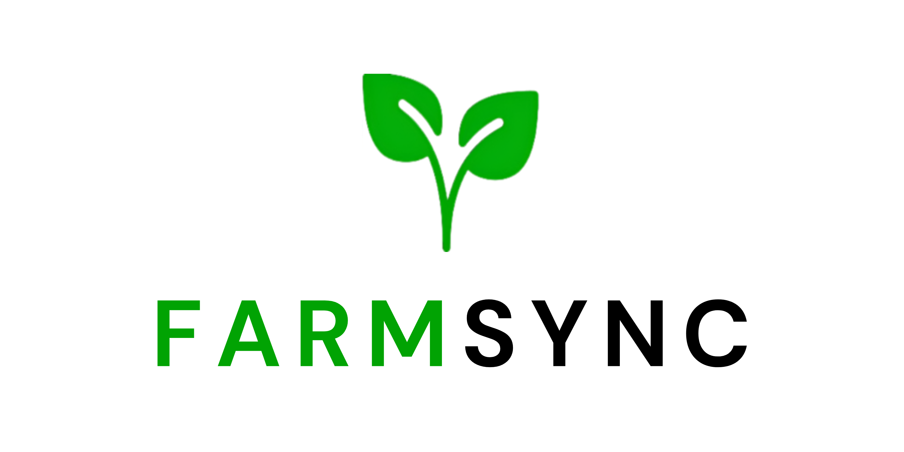

# FarmSync

An innovative, data-driven decision support system designed specifically for Sri Lankan farmers. FarmSync empowers farmers to make informed decisions that maximize productivity, boost profitability, and promote sustainable agricultural practices.

> **Note:** The application is currently under active development. Features and documentation are subject to change.

## Project Overview

FarmSync is revolutionizing Sri Lankan agriculture through technology integration. By combining real-time data analytics, machine learning, and an intuitive user interface, we provide farmers with the tools they need to optimize their farming operations and adopt sustainable practices.

## 🌟 Key Features

- **Real-time Data Analytics**
  - Weather monitoring based on location
  - Market price analysis

- **Smart Recommendations**
  - Crop selection guidance
  - Crop management guidance
  - Optimal planting times
  - Resource optimization
  - Pest management strategies

- **User-Friendly Interface**
  - Intuitive dashboard
  - Mobile-responsive design
  - Multi-language support
  - Easy navigation

- **Market Integration**
  - Price tracking
  - Demand forecasting
  - Supply chain optimization
  - Market trend analysis

## 🛠️ Website Tech Stack

- **React.js** - For building the user interface
- **Tailwind CSS** - For styling and responsive design
- **Shadcn/ui** - For UI components
- **Lucide Icons** - For beautiful and consistent icons
- **EmailJS** - For contact form functionality
